<h1 align="center">CLEVERTEC</h1>
<h2 align="center">🚀 Test task - Receipt API</h2>

[](https://www.repostatus.org/#wip)
[](https://github.com/IvanHayel/clevertec-test-task/blob/master/LICENSE.md)
[](http://hits.dwyl.com/IvanHayel/clevertec-test-task)
[](https://github.com/IvanHayel)

<details>
  <summary style="font-weight: bold; font-size: large">Table of Contents</summary>
  <ol>
    <li>
      <a href="#-task-description">Task Description</a>
      <ul>
        <li><a href="#-task">Task</a></li>
        <li><a href="#-main-technologies">Main Technologies</a></li>
      </ul>
    </li>
    <li>
      <a href="#%EF%B8%8F-getting-started">Getting Started</a>
      <ul>
        <li><a href="#-the-easiest-way-">The Easiest Way</a></li>
        <li><a href="#-start-with-docker">Start with Docker</a></li>
        <li><a href="#-local-startup-with-gradle">Local Startup with Gradle</a></li>
      </ul>
    </li>
    <li>
      <a href="#-api-usage">API Usage</a>
      <ul>
        <a href="#-endpoints">Endpoints</a>
        <ul>
            <li><a href="#-products">Products</a></li>
            <li><a href="#-discount-cards">Discount Cards</a></li>
            <li><a href="#-receipts">Receipts</a></li>
        </ul>
      </ul>
    </li>
    <li>
      <a href="#-demo">Demo</a>
      <ul>
        <li>
            <a href="#-products-demo">Products Demo</a>
            <ul>
                <li><a href="#get-all-products">Get all products</a></li>
                <li><a href="#get-product-by-id">Get product by id</a></li>
                <li><a href="#products-full-text-search">Products full text search</a></li>
                <li><a href="#add-new-product">Add new product</a></li>
                <li><a href="#update-existing-product">Update existing product</a></li>
                <li><a href="#delete-product">Delete product</a></li>
            </ul>
        </li>
        <li>
            <a href="#-discount-cards-demo">Discount Cards Demo</a>
            <ul>
                <li><a href="#get-all-cards">Get all cards</a></li>
                <li><a href="#get-card-by-id">Get card by id</a></li>
                <li><a href="#add-new-card">Add new card</a></li>
                <li><a href="#update-existing-card">Update existing card</a></li>
                <li><a href="#delete-card">Delete card</a></li>
            </ul>
        </li>
        <li>
            <a href="#-receipts-demo">Receipts Demo</a>
            <ul>
                <li><a href="#get-all-receipts">Get all receipts</a></li>
                <li><a href="#get-receipt-by-id">Get receipt by id</a></li>
                <li><a href="#receipts-full-text-search">Receipts full text search</a></li>
                <li><a href="#download-receipt-in-pdf">Download receipt in PDF</a></li>
                <li><a href="#add-new-receipt">Add new receipt</a></li>
                <li><a href="#update-existing-receipt">Update existing receipt</a></li>
                <li><a href="#delete-receipt">Delete receipt</a></li>
            </ul>
        </li>
      </ul>
    </li>
  </ol>
</details>

## 📄 Task Description

### [📝 Task](./documentation/task.pdf)

### 📝 Main Technologies

|  **Database**  |                                                              [](https://www.postgresql.org/)                                                              |
|:--------------:|:-------------------------------------------------------------------------------------------------------------------------------------------------------------------------------------------------------------------------------------------------------------------------------:|
|  **Backend**   |         [](https://dev.java/) [](https://spring.io/)          |
| **Build Tool** |                                                                        [](https://gradle.org/)                                                                         |
|    **PaaS**    | [](https://www.docker.com/) [](https://www.heroku.com/) |

---

## ⚙️ Getting Started

### ⏩ The Easiest Way ⏩

<strong>API already deployed on PaaS Heroku:</strong>

### 🚀 Heroku link

```
https://clevertec-test-task.herokuapp.com
```

#### <strong><a href="#-api-usage">JUMP TO API USAGE</a></strong>

### 🐋 Start with Docker

* Clone the repository

```console
git clone https://github.com/IvanHayel/clevertec-test-task.git
```

* Use docker-compose

```console
docker-compose up
```

#### <strong><a href="#-api-usage">JUMP TO API USAGE</a></strong>

### 🦖 Local Startup with Gradle

> Java version 17+ is required.

* Clone the repository

```console
git clone https://github.com/IvanHayel/clevertec-test-task.git
```

* Create Postgres Database

Example:

```sql
CREATE DATABASE "clevertec-api"
    WITH
    OWNER = postgres
    ENCODING = 'UTF8'
    LC_COLLATE = 'English_World.1252'
    LC_CTYPE = 'English_World.1252'
    TABLESPACE = pg_default
    CONNECTION LIMIT = -1;
```

* Set up environment variables

> DB_URL - JDBC url for Postgres database.
>
> DB_USERNAME - database username
>
> DB_PASSWORD - database password

* Run Gradle

```console
gradle clean build bootRun
```

> You can also use the gradle wrapper: `./gradlew`

---

## 🔥 API Usage

### 💠 Endpoints

<h3 align="center">📦 PRODUCTS</h2>

| **HTTP METHOD** |          **URL**          |      **QUERY PARAMETERS**       |                            **TEMPLATE**                             | *DESCRIPTION*                        |
|:---------------:|:-------------------------:|:-------------------------------:|:-------------------------------------------------------------------:|--------------------------------------|
|     **GET**     |    `/api/v1/products`     |              none               |                                none                                 | Getting all `Products`.              |
|     **GET**     |  `/api/v1/products/{id}`  |              none               |                                none                                 | Getting `Product` by id.             |
|     **GET**     | `/api/v1/products/search` | `term`: {any} - <i>required</i> |                                none                                 | Full text search for all `Products`. |
|    **POST**     |    `/api/v1/products`     |              none               | 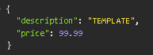 | Creating a new `Product`.            |
|     **PUT**     |    `/api/v1/products`     |              none               |  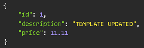  | Updating existing `Product`.         |
|   **DELETE**    |  `/api/v1/products/{id}`  |              none               |                                none                                 | Deleting `Product` by id.            |

<h3 align="center">💳 DISCOUNT CARDS</h2>

| **HTTP METHOD** |       **URL**        | **QUERY PARAMETERS** |                           **TEMPLATE**                           | *DESCRIPTION*                      |
|:---------------:|:--------------------:|:--------------------:|:----------------------------------------------------------------:|------------------------------------|
|     **GET**     |   `/api/v1/cards`    |         none         |                               none                               | Getting all `Discount Cards`.      |
|     **GET**     | `/api/v1/cards/{id}` |         none         |                               none                               | Getting `Discount Card` by id.     |
|    **POST**     |   `/api/v1/cards`    |         none         | 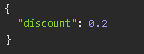 | Creating a new `Discount Card`.    |
|     **PUT**     |   `/api/v1/cards`    |         none         |  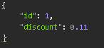  | Updating existing `Discount Card`. |
|   **DELETE**    | `/api/v1/cards/{id}` |         none         |                               none                               | Deleting `Discount Card` by id.    |

<h3 align="center">🧾 RECEIPTS</h2>

| **HTTP METHOD** |             **URL**              |      **QUERY PARAMETERS**       |                            **TEMPLATE**                             | *DESCRIPTION*                              |
|:---------------:|:--------------------------------:|:-------------------------------:|:-------------------------------------------------------------------:|--------------------------------------------|
|     **GET**     |        `/api/v1/receipts`        |              none               |                                none                                 | Getting all `Receipts`.                    |
|     **GET**     |     `/api/v1/receipts/{id}`      |              none               |                                none                                 | Getting `Receipt` by id.                   |
|     **GET**     |    `/api/v1/receipts/search`     | `term`: {any} - <i>required</i> |                                none                                 | Full text search for all `Receipts`.       |
|     **GET**     | `/api/v1/receipts/download/{id}` |              none               |                                none                                 | Download existing `Receipt` in PDF format. |
|    **POST**     |        `/api/v1/receipts`        |              none               | 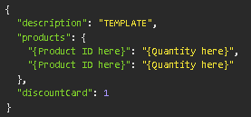 | Creating a new `Receipt`.                  |
|     **PUT**     |        `/api/v1/receipts`        |              none               |  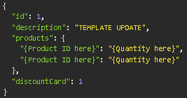  | Updating existing `Receipt`.               |
|   **DELETE**    |     `/api/v1/receipts/{id}`      |              none               |                                none                                 | Deleting `Receipt` by id.                  |

---

## 🪄 Demo

> Insomnia used for demonstration.

<h3 align="center">📦 PRODUCTS DEMO</h2>

### Get all products

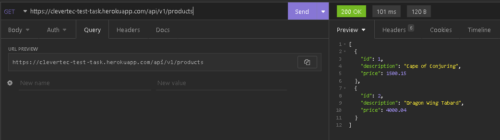

### Get product by id

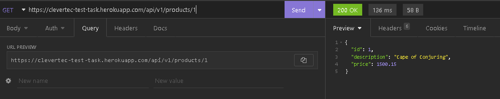

### Products full text search

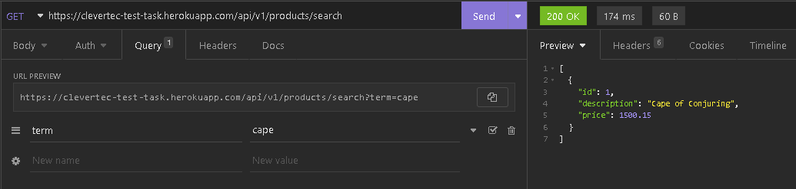

### Add new product

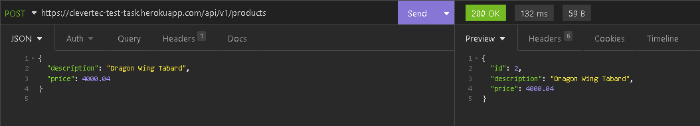

### Update existing product

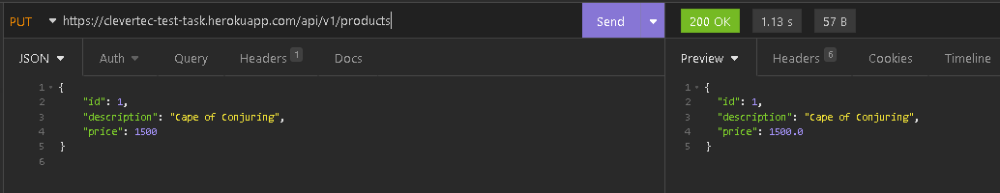

### Delete product

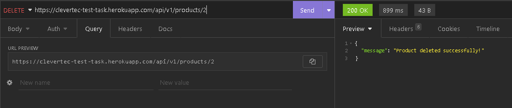

<h3 align="center">💳 DISCOUNT CARDS DEMO</h2>

### Get all cards

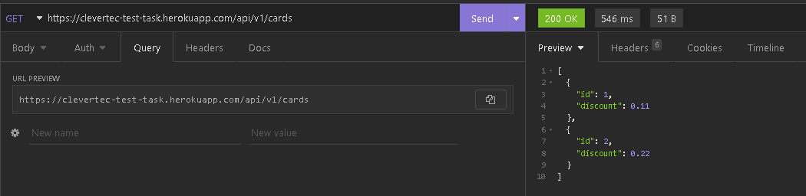

### Get card by id

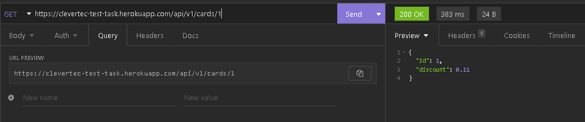

### Add new card

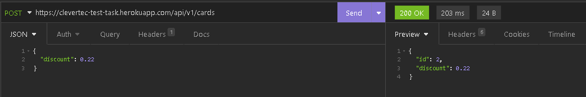

### Update existing card

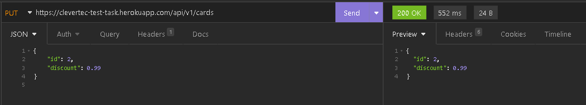

### Delete card

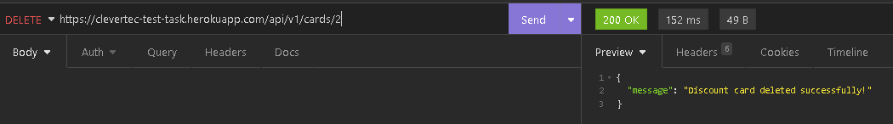

<h3 align="center">🧾 RECEIPTS DEMO</h2>

### Get all receipts

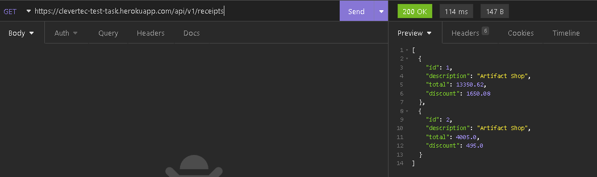

### Get receipt by id

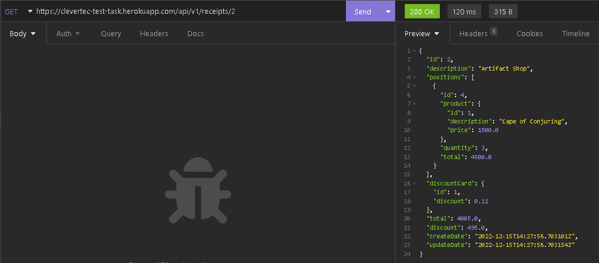

### Receipts full text search

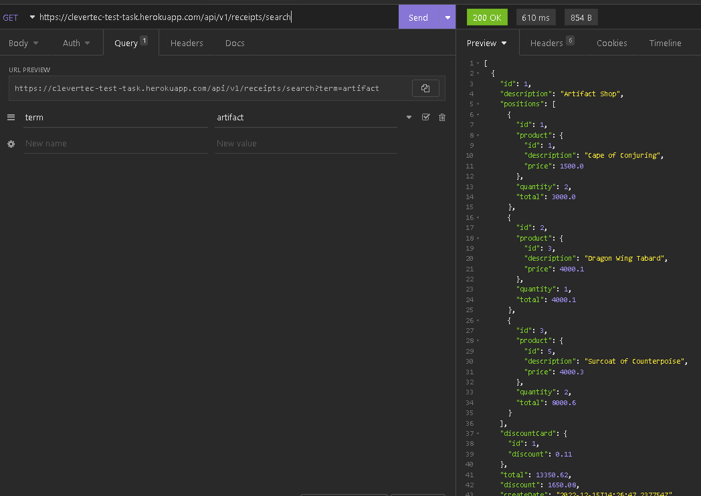

### Download receipt in PDF


### Add new receipt

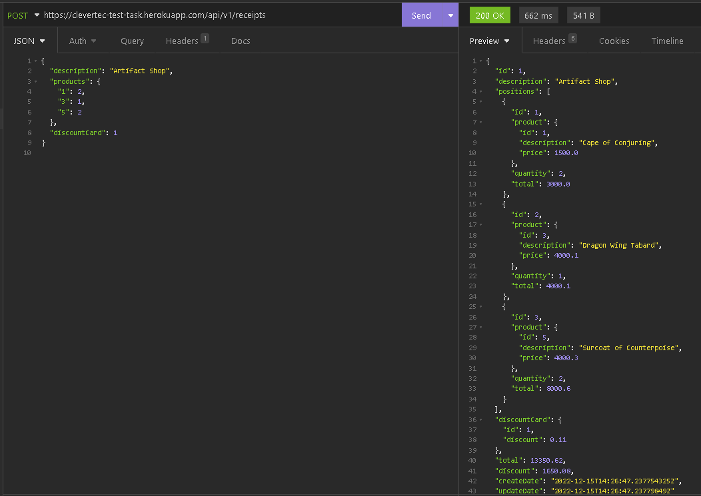

### Update existing receipt

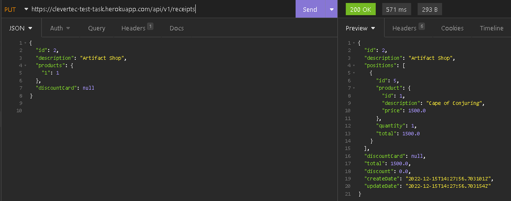

### Delete receipt

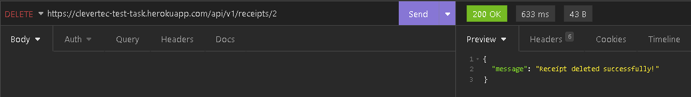